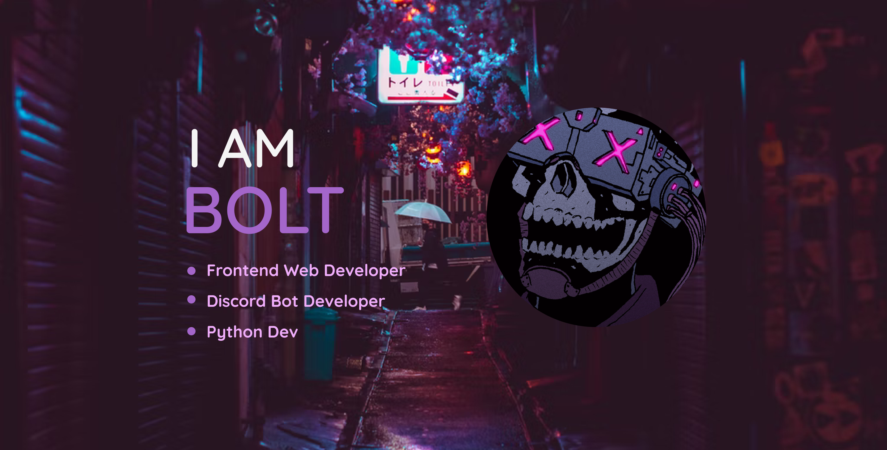

<h1 align="center">Hewwo OwO</h1>
<h3 align="center">I'm a passionate 14 year old frontend developer from India.</h3>
 

<h3 align="center">Languages and Tools:</h3>

[]

 

 <h3>Github Stats:</h3> 
  

<!-- 

    <h3>My Language Stats</h3>
    

 -->
